# 🛡️ Security Implementation Guide - Trivy Integration

## ✅ **Complete Implementation Summary**

I've successfully implemented comprehensive security scanning for your MSMEBazaar monorepo using Trivy. Here's what has been added:

### 🔧 **Security Features Implemented:**

1. **✅ Comprehensive GitHub Actions Security Pipeline**
2. **✅ Trivy Filesystem & Container Scanning**
3. **✅ Secret Detection & Credential Scanning**
4. **✅ NPM Package Vulnerability Auditing**
5. **✅ Critical/High Vulnerability Blocking**
6. **✅ Local Security Scanning Script**
7. **✅ Security Policy & Documentation**

## 📁 **New Security Files Added:**

```
📁 Security Configuration Files:
├── .github/workflows/ci.yml         # ✅ Enhanced with security-scan job
├── .trivyignore                     # ✅ Vulnerability exceptions list
├── trivy.yaml                       # ✅ Trivy configuration
├── trivy-secret.yaml               # ✅ Secret detection rules
├── scripts/security-scan.sh        # ✅ Local security scanning script
├── SECURITY_POLICY.md              # ✅ Security policy & procedures
└── SECURITY_IMPLEMENTATION_GUIDE.md # ✅ This implementation guide
```

## 🚀 **Security Pipeline Flow:**

```mermaid
graph TD
    A[Code Push/PR] --> B[Install Dependencies]
    B --> C[TypeScript Check]
    C --> D[Build Applications]
    D --> E[Run Tests]
    E --> F[Security Scan Job]
    
    F --> G[Build Docker Images]
    F --> H[Trivy Filesystem Scan]
    F --> I[Trivy Image Scan]
    F --> J[Secret Detection]
    F --> K[NPM Security Audit]
    
    G --> L{Critical/High Vulns?}
    H --> L
    I --> L
    J --> L
    K --> L
    
    L -->|Yes| M[❌ FAIL CI]
    L -->|No| N[✅ PASS - Deploy]
    
    M --> O[Upload Security Reports]
    N --> P[Deploy to Production]
```



## 🔍 **Security Scans Performed:**

### **1. Filesystem Vulnerability Scanning**
- **Target**: Source code and dependencies
- **Coverage**: All apps and libraries in monorepo
- **Severity**: Critical, High, Medium vulnerabilities
- **Output**: SARIF files for GitHub Security tab

### **2. Docker Image Scanning**
- **Images Scanned**:
  - `msmebazaar-web:latest` (Next.js Web App)
  - `msmebazaar-auth-api:latest` (FastAPI Auth Service)
  - `msmebazaar-msme-api:latest` (FastAPI MSME Service)
  - `msmebazaar-admin-api:latest` (FastAPI Admin Service)
  - `msmebazaar-match-api:latest` (FastAPI Match Service)
- **Checks**: OS packages, libraries, base image vulnerabilities

### **3. Secret Detection**
- **Patterns Detected**:
  - AWS Access Keys (`AKIA*`)
  - Database URLs (`postgres://`, `mysql://`)
  - API Keys and Tokens
  - JWT Tokens (`eyJ*`)
  - Private Keys (`-----BEGIN *PRIVATE KEY-----`)
  - GitHub Personal Access Tokens
  - Third-party service credentials

### **4. NPM Package Auditing**
- **Scope**: All Node.js projects in monorepo
- **Threshold**: High and Critical severity
- **Coverage**: Production and development dependencies

## 🚨 **Security Failure Conditions:**

The CI pipeline will **FAIL** if any of the following are detected:

| Condition | Severity | Action |
|-----------|----------|---------|
| **Critical OS Vulnerabilities** | Critical | ❌ Block deployment |
| **High Application Vulnerabilities** | High | ❌ Block deployment |
| **Hardcoded Secrets** | Any | ❌ Block deployment |
| **Critical NPM Vulnerabilities** | Critical/High | ❌ Block deployment |
| **Insecure Docker Configurations** | High | ❌ Block deployment |

## 📋 **Setup Instructions:**

### **Step 1: GitHub Repository Secrets**

Add these secrets to your GitHub repository:

```bash
# Required for Snyk integration (optional)
SNYK_TOKEN=your_snyk_token_here

# Required for Slack notifications (optional)
SLACK_WEBHOOK=your_slack_webhook_url_here
```

### **Step 2: Install Trivy Locally (for developers)**

```bash
# macOS
brew install aquasecurity/trivy/trivy

# Ubuntu/Debian
wget -qO - https://aquasecurity.github.io/trivy-repo/deb/public.key | sudo apt-key add -
echo deb https://aquasecurity.github.io/trivy-repo/deb $(lsb_release -sc) main | sudo tee -a /etc/apt/sources.list.d/trivy.list
sudo apt-get update && sudo apt-get install trivy

# Or download binary from GitHub releases
curl -sfL https://raw.githubusercontent.com/aquasecurity/trivy/main/contrib/install.sh | sh -s -- -b /usr/local/bin
```

### **Step 3: Run Local Security Scan**

```bash
# Make script executable (already done)
chmod +x scripts/security-scan.sh

# Run full security scan
./scripts/security-scan.sh

# Run specific scans
./scripts/security-scan.sh --fs-only      # Filesystem only
./scripts/security-scan.sh --secrets-only # Secrets only
./scripts/security-scan.sh --docker-only  # Docker images only
./scripts/security-scan.sh --npm-only     # NPM audit only
```

## 🔧 **Managing Vulnerabilities:**

### **Fixing Critical/High Vulnerabilities:**

1. **Update Dependencies**:
```bash
# Update npm packages
cd msmebazaar-v2
pnpm update

# Update base Docker images
# Edit Dockerfiles to use newer base image versions
FROM node:18-alpine  # Update to node:20-alpine if available
```

2. **Apply Security Patches**:
```bash
# Check for security updates
npm audit fix

# Or use pnpm
pnpm audit --fix
```

3. **Update Base Images**:
```dockerfile
# Before
FROM python:3.11-slim

# After (check for newer versions)
FROM python:3.12-slim
```

### **Adding Vulnerability Exceptions:**

If a vulnerability is a false positive or has been assessed as acceptable risk:

1. **Document the Assessment**:
```markdown
**CVE-ID**: CVE-2024-12345
**Severity**: HIGH
**Component**: example-package@1.2.3
**Impact**: Potential XSS via user input
**Risk Assessment**: Low - input is sanitized before processing
**Mitigation**: WAF rules block malicious patterns
**Review Date**: 2024-06-01
**Approved By**: Security Team Lead
**Ticket**: SEC-456
```

2. **Add to `.trivyignore`**:
```bash
# CVE-2024-12345 - example-package XSS vulnerability
# Risk: Low - input sanitized, WAF protection in place
# Review: 2024-06-01 - Ticket: SEC-456
CVE-2024-12345
```

## 📊 **Security Reports & Monitoring:**

### **GitHub Security Tab Integration**
- SARIF reports are automatically uploaded to GitHub Security tab
- Vulnerabilities appear in "Security" → "Code scanning alerts"
- Track remediation progress over time

### **Downloadable Reports**
```bash
# Download security scan artifacts from GitHub Actions
gh run download <run-id> --name security-scan-results

# Local reports directory
ls ./security-reports/
- filesystem_scan_20240125_143022.json
- secrets_scan_20240125_143022.json
- security_summary_20240125_143022.md
```

### **CI/CD Integration**
- **Slack Notifications**: Failed security scans trigger alerts
- **Deployment Blocking**: Critical/High vulnerabilities prevent deployment
- **Metrics Tracking**: Security scan results tracked over time

## 🐛 **Troubleshooting:**

### **Common Issues & Solutions:**

#### **1. Trivy Database Update Failures**
```bash
# Error: Failed to update vulnerability database
# Solution: Clear cache and retry
trivy clean --all
trivy image --download-db-only
```

#### **2. False Positive Secrets**
```bash
# Error: Secret detected in test files
# Solution: Add to trivy-secret.yaml allowlist
allowlist:
  - description: "Test JWT token for unit tests"
    path: "tests/fixtures/auth.json"
    rule: "jwt-token"
```

#### **3. Docker Build Failures**
```bash
# Error: Docker build failed during security scan
# Solution: Check Dockerfile syntax and dependencies
cd msmebazaar-v2/apps/web
docker build -t test-image .
```

#### **4. NPM Audit Failures**
```bash
# Error: High/Critical npm vulnerabilities
# Solution: Update packages or add overrides
pnpm audit --fix
# Or add to package.json:
"overrides": {
  "vulnerable-package": "^2.0.0"
}
```

## 🚀 **Testing the Security Setup:**

### **Test 1: Verify Security Scan Works**
```bash
# Create a test vulnerability
echo "password=secret123" > test-secret.txt
git add test-secret.txt

# Run local scan - should detect secret
./scripts/security-scan.sh --secrets-only

# Clean up
rm test-secret.txt
```

### **Test 2: Verify CI Pipeline**
```bash
# Push changes and check CI
git add .
git commit -m "feat: add comprehensive security scanning"
git push origin main

# Check GitHub Actions
gh run list --workflow=ci.yml
```

### **Test 3: Verify Vulnerability Blocking**
```bash
# Temporarily add a known vulnerable package
cd msmebazaar-v2
pnpm add lodash@4.17.19  # Known vulnerable version

# Run security scan - should fail
./scripts/security-scan.sh --npm-only

# Remove vulnerable package
pnpm remove lodash
```

## 📈 **Security Metrics to Track:**

- **Zero Critical/High Vulnerabilities** in production
- **Mean Time to Remediation (MTTR)** < 7 days for high severity
- **Security Scan Coverage** > 95% of codebase
- **False Positive Rate** < 5% for secret detection
- **Vulnerability Trend** decreasing over time

## 🔄 **Regular Maintenance:**

### **Weekly Tasks:**
- Review security scan reports
- Update dependencies with security patches
- Clean up resolved vulnerabilities from `.trivyignore`

### **Monthly Tasks:**
- Review and update base Docker images
- Audit `.trivyignore` entries for expired reviews
- Update Trivy security rules and configurations

### **Quarterly Tasks:**
- Security policy review
- Penetration testing
- Security training for development team
- Review and update incident response procedures

## 📞 **Security Contacts:**

- **Security Issues**: security@msmebazaar.com
- **CI/CD Issues**: devops@msmebazaar.com
- **Emergency**: incident@msmebazaar.com

## 🎯 **Expected Results:**

✅ **CI Pipeline with Zero Critical Vulnerabilities**  
✅ **Automated Security Scanning on Every Commit**  
✅ **Secret Detection & Prevention**  
✅ **Comprehensive Security Reports**  
✅ **Local Development Security Tools**  
✅ **Production Deployment Protection**  

The security setup ensures that **no critical or high severity vulnerabilities** reach production, maintaining a strong security posture for the MSMEBazaar platform.

---

**Implementation Complete** ✅  
**Last Updated**: January 2025  
**Version**: 1.0